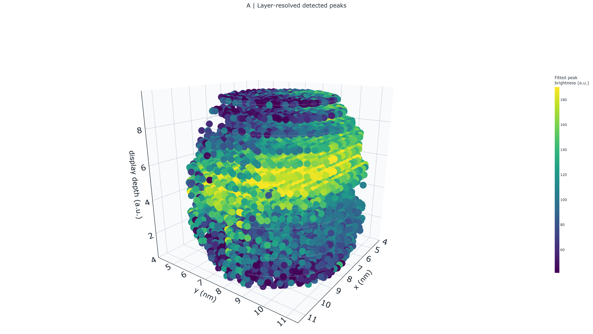

# Code Release - Pt3(Ga,In,Sn,Zn) High-Entropy Intermetallic Assembly

This repository accompanies the manuscript *Data-Guided Liquid-Metal
Synthesis of High-Entropy Intermetallics* and provides the scripts, reference
outputs, and reviewer-facing documentation needed to reproduce the numerical
results underlying Figure 1 (thermodynamic design and the related Supplementary
Information) and Figure 3 (atomic-ordering analysis of the reaction
intermediate from 4D-STEM multislice electron ptychography).



Open the interactive 3-D view (drag/rotate, adjust opacity, spacing and projection): [A_white_layer_resolved_readable_interactive.html](Figure3/interactive_3d/A_white_layer_resolved_readable_interactive.html)

This working tree prepares `v1.4.0` (Figure 3 package on top of the v1.3.2
scientific-audit corrections) and is not yet an archived release. The latest
archived release is `v1.3.1`; the additions documented here require a new
exact-version archive before submission.

## Code availability

- Repository: `https://github.com/cui-group-ai-catalyst/PtGaInSnZn-HE-IMC`
- Zenodo concept DOI (all versions): `https://doi.org/10.5281/zenodo.20111606`
- Exact version DOI for `v1.3.1`: `https://doi.org/10.5281/zenodo.20511673`
- Latest archived release tag: `v1.3.1`
- Current working target: `v1.4.0` (exact-version DOI pending)

All in-house code is released under the MIT License. Third-party model weights
and datasets are not redistributed. Their sources, versions, licenses, and
access restrictions are documented in `Third_Party_Model_and_Data_Notes.md`.
The UMA-s-1p1 checkpoint is a gated external model dependency and must be
obtained from `facebook/UMA` on Hugging Face under the upstream terms; see
`UMA_Checkpoint_Setup.md`.

## System requirements

### Operating systems

Release files were audited locally on:

- Microsoft Windows 11 Home China, version 10.0.26200, 64-bit.

The CPU-only analytical scripts use standard Python packages and are expected
to run on Linux and macOS with a compatible conda environment. The UMA-based
scripts are more sensitive to GPU, PyTorch, `fairchem-core`, and local
checkpoint provisioning.

### Software dependencies

Create the conda environment from `environment.yml`:

```bash
conda env create -f environment.yml
conda activate ptgainsnzn
```

Pinned versions include:

- Python 3.10.19
- pip 24.2
- numpy 2.0.2
- pandas 2.3.3
- matplotlib 3.10.8
- seaborn 0.13.2
- scipy 1.14.1
- ase 3.22.1
- pymatgen 2025.10.7
- fairchem-core 2.13.0
- chgnet 0.4.0

### Non-standard hardware

The quick CPU demo and the analytical Miedema/Hildebrand scripts do not require
GPU hardware.

The bundled UMA-derived reference CSVs can be inspected and post-processed on
CPU. Recomputing UMA single-point energies from raw structures requires the
gated UMA-s-1p1 checkpoint with MD5 `36a2f071350be0ee4c15e7ebdd16dde1` (see
`UMA_Checkpoint_Setup.md`). A CUDA-capable GPU is recommended for practical
wall-clock time when re-running UMA calculations, but it is not required for
the quick reviewer demo or for verifying the bundled numerical outputs.

## Installation

From a clean machine with conda or mamba installed:

```bash
git clone https://github.com/cui-group-ai-catalyst/PtGaInSnZn-HE-IMC.git
cd PtGaInSnZn-HE-IMC
conda env create -f environment.yml
conda activate ptgainsnzn
```

Typical install time on a normal desktop or workstation:

- CPU-only scientific stack: approximately 10-25 minutes, depending on network
  speed and conda solver performance.
- Full environment including `fairchem-core` and `chgnet`: approximately
  20-45 minutes.
- UMA checkpoint download/setup: additional time; depends on Hugging Face access
  approval and network speed.

For faster dependency solving, `mamba env create -f environment.yml` can be used
as a drop-in replacement if mamba is available.

## Demo

The recommended reviewer demo is CPU-only and does not require UMA or GPU.
For a step-by-step path intended for reviewers who are not familiar with this
code base, see `REVIEWER_REPRODUCTION_GUIDE.md`.

### Demo commands

```bash
conda activate ptgainsnzn
python Panel_a_BinaryHeatmap/regen_FigA_data.py
python Panel_b_MultiComponentScatter/verify_FigB_central.py
python experimental_extensions/run_validation.py
python scripts/verify_release.py
```

### Demo expected output

The demo should regenerate or verify:

- `Panel_a_BinaryHeatmap/data_FigA_v2_FamilyOrdered_Origin_regen.csv`
- `Panel_b_MultiComponentScatter/data_FigB_central_anchors_regen.csv`
- `experimental_extensions/outputs/system_validation/validation_evidence.png`
- `experimental_extensions/outputs/system_validation/evidence_report.html`
- `experimental_extensions/outputs/system_validation/evidence_report.pdf`

Key expected numerical checks:

- `DeltaH_mix(Pt-Ga) = -32.06 kJ/mol`
- Pt is ranked `1` as the most negative central host in Panel b
- `Pt dH_mix(c_host=0.25) = -24.440 kJ/mol`
- `Pt dG_mix(500 K) = -29.839 kJ/mol`

Expected runtime on a normal desktop computer:

- Panel a regeneration: less than 1 minute.
- Panel b central verification: less than 1 minute.
- `scripts/verify_release.py`: less than 1 minute.

## Instructions for use

This repository is a reproducibility package for the manuscript, not a general
software library. Use the panel folders to reproduce the manuscript numerical
results and inspect the assumptions for each model.

Recommended workflow:

1. Read `Figure1_Code_Map.csv` (and `Figure3/Figure3_Code_Map.csv` for the
   structural analyses) to identify the script, reference CSV, preview PNG, and
   UMA/Origin requirement for each panel.
2. Run the quick CPU demo above.
3. Run analytical panels a, b, and f without UMA.
4. For UMA-derived panels c, d, e and SI Figs. 3/4, first decide whether the
   goal is post-processing bundled CSVs or re-running UMA energy calculations.
5. For post-processing, run the scripts listed in `Figure1_Code_Map.csv` and
   compare regenerated outputs with the bundled reference CSVs.
6. For UMA re-runs, configure the checkpoint following `UMA_Checkpoint_Setup.md`
   and note the limitations disclosed below.

To adapt the scripts to new host/liquid systems, edit the host lists,
composition dictionaries, or local parameter tables in the relevant panel
folder. The scripts are intentionally transparent and panel-specific. See
the next section "Using your own data" for concrete substitution workflows.

Scientific scope: this is a manuscript-specific reproducibility package, not
a validated general-purpose materials predictor. Input substitution or a
successful software run does not establish transferability to a new host,
prototype, bonding class, or synthesis route. The configuration-driven tools
under `experimental_extensions/` are kept separate for this reason.

## Using your own data

The Nature Software Submission Checklist asks for instructions on running the
software on your own data. This section covers the three substitution
scenarios a reviewer or follow-up user is most likely to want, in increasing
order of effort.

### Scenario A — substitute your own element reference energies

**Use case:** you have your own 5 element reference energies for Pt, Ga, In,
Sn, Zn (for example from PBE-DFT, or from a different ML potential such as
CHGNet or MACE) and you want to check how the manuscript Pt3(Ga,In,Sn,Zn)
formation-enthalpy landscape changes when the reference set is swapped, while
keeping the per-prototype alloy energies from UMA-s-1p1 as ground truth.

1. Prepare a CSV at any path, with columns `Element` and `E_eV_atom`. The 5
   rows for Pt, Ga, In, Sn, Zn must all be present. Example:

   ```csv
   Element,E_eV_atom
   Pt,-5.4500
   Ga,-2.5300
   In,-2.1700
   Sn,-3.4500
   Zn,-0.7200
   ```

2. Run the substitution script:

   ```bash
   python scripts/recompute_element_referenced_Hf.py --user-refs my_refs.csv
   ```

3. Inspect the output `shared/ElementRef_Hf_USER_vs_BUNDLED.csv`. It contains
   all 165 prototypes with both the bundled `ElementRef_Hf_kJ_mol` and your
   recomputed `User_ElementRef_Hf_kJ_mol` plus a per-row difference.

Running the script with no `--user-refs` argument reproduces the bundled
column exactly (max diff `0.000000 kJ/mol/atom`), confirming that the
substitution formula matches the manuscript pipeline.

### Scenario B — re-run with a different ML potential or DFT

**Use case:** you want to repeat the entire UMA single-point workflow with a
different potential (CHGNet, MACE, M3GNet, PBE-DFT) and compare against the
manuscript values end to end.

1. The 5 conventional element reference structures used in the manuscript are
   bundled at `shared/element_reference_structures/*.cif`. Run your potential
   on each to obtain your 5 `E_elem` values in eV/atom.
2. Reconstruct the 165 Pt3X8 32-atom 2x2x2 prototypes from
   `SI_Figures/SI_Fig04_165CompositionLandscape/data_FigG_165_ElementReferenced_Hf.csv`.
   Each row's `Composition`, `Ga_count`, `In_count`, `Sn_count`, `Zn_count`
   columns are the recipe: 24 Pt atoms on the A sublattice of an L1_2
   2x2x2 supercell (lattice constant 3.903 Angstrom), with the 8 B-sublattice
   sites populated according to the count vector. Run your potential on each
   to obtain your own `Energy_eV_atom` column.
3. Apply the formula directly: for each prototype,
   `DeltaH_f = (E_alloy - (24*E_Pt + n_Ga*E_Ga + n_In*E_In + n_Sn*E_Sn + n_Zn*E_Zn) / 32) * 96.485`
   in kJ/mol/atom.
4. The same recipe is implemented in `scripts/recompute_element_referenced_Hf.py`;
   if you replace its bundled `Energy_eV_atom` column with your own
   per-prototype energies and also pass `--user-refs`, you get a full
   end-to-end substitution.

### Scenario C — extend with your own compositions

**Use case:** you want to add new compositions that are not in the bundled
165 list (for example, swap Zn for Bi, or add a 5-component cocktail).

This is an experimental developer workflow, not part of the frozen manuscript
reproduction path. `experimental_extensions/run_manifold.py` can validate an
integer composition table and fit the same pairwise CEF form from a JSON
configuration. It does not validate the structures, energy method, competing
phases, interfaces, kinetics, or synthesizability of the substituted system.

At the system level, `experimental_extensions/system_manifest.json` provides
a schema-checked P1 interface and `experimental_extensions/run_validation.py`
runs the complete bounded validation workflow. The bundled manifest combines
the fixed-manifold CEF/LOOCV/group-holdout checks with a three-backend binary
reference comparison (Materials Project DFT, UMA-s-1p1, and CHGNet), including
RMSE, Spearman correlation, top-k overlap, and explicit ranking reversals.
These outputs demonstrate configurable software and transparent validation;
they are not evidence that a new chemistry is scientifically transferable.

1. Build the structure for each new composition (extend the 8-site B
   sublattice with the new element distribution; use the same Pt3X8
   2x2x2 L1_2 base supercell from Scenario B).
2. Run UMA-s-1p1 (or any potential) to obtain `E_alloy` for each new
   structure. UMA setup is documented in `UMA_Checkpoint_Setup.md`.
3. Append the new rows to a copy of
   `SI_Figures/SI_Fig04_165CompositionLandscape/data_FigG_165_ElementReferenced_Hf.csv`,
   filling in `Ga_count`, `In_count`, `Sn_count`, `Zn_count`, and
   `Energy_eV_atom`. Leave `ElementRef_Hf_kJ_mol` blank.
4. Run `scripts/recompute_element_referenced_Hf.py` and use its
   `User_ElementRef_Hf_kJ_mol` column to obtain consistent formation
   enthalpies for the new compositions. If your new structure includes a
   new element (for example Bi), extend `shared/UMA_Element_Reference_Energies.csv`
   and `scripts/recompute_element_referenced_Hf.py` to include it.

### Raw-energy reproduction and remaining end-to-end boundaries

- **Panel c historical regression (1 ordered + 30 disordered
  Pt3(Ga,In,Sn,Zn) equimolar configurations).** The release ships the original per-structure
  `Energy_eV_atom` values in
  `Panel_c_OrderedVsDisordered/data_FigC_Raw_UMA_Energies.csv` and the
  deterministic structure/UMA rerun entry point
  `script_FigC_Rerun_UMA.py`. The 30 disordered occupations use seeds
  100-129. The script writes `_regen` data and a JSON comparison report; it
  can also export all 31 generated CIFs.
- **Panel c ensemble robustness (30 ordered + the original 30 disordered).**
  `script_FigC_OrderedEnsemble_Rerun_UMA.py` enumerates 2,520 labelled
  Ga2In2Sn2Zn2 B-site assignments, reduces them to 68 symmetry classes, keeps
  the historical ordered anchor, and selects 29 additional classes with seed
  20260727. `script_FigC_OrderedEnsemble_Analysis.py` produces the measured
  30+30 comparison. The optional `--n-ordered 68` path and
  `script_FigC_OrderedAll68_Sensitivity.py` verify that the 30-class sample
  reproduces the degeneracy-weighted all-class mean.
- **Panel d ensemble temperature model.**
  `Panel_d_GibbsCurveVsT/script_FigD_GibbsCurve_Ensemble.py` reads the measured
  30+30 Panel c energies and adds ideal configurational-entropy bounds. It
  writes separate ensemble CSV/JSON/PDF/SVG/PNG/TIFF artifacts and does not
  overwrite the historical canonical Panel d files. These curves are model
  bounds, not phonon-inclusive or directly sampled finite-temperature free
  energies.
- **The CEF fit in Panel e** consumes the SI Fig 4 landscape. After
  Scenario A or Scenario B above, the CEF inputs change; rerunning Panel e
  scripts with the substituted Hf values is straightforward but is not
  automated by a one-liner.

## Reproducing manuscript results

The repository contains two reproducibility levels:

- Level A, self-contained analytical panels:
  - Figure 1a
  - Figure 1b central check and released scatter outputs
  - Figure 1f
  - Supplementary Fig. 2
  - Miedema components of Supplementary Fig. 3
- Level B, UMA-derived panels:
  - Figure 1c
  - Figure 1d
  - Figure 1e
  - Supplementary Fig. 3 UMA column
  - Supplementary Fig. 4
- Figure 3 (4D-STEM structural analysis), three reproducibility tiers:
  - Fully reproducible from bundled data: Figure 3h (row-resolved projected-column
    modulation; `Figure3/analysis/analyze_h_l8_projected_rows.py` +
    `Figure3/build/render_compact_h.py`), Figure 3i1 (3-D rendering +
    interactive HTML; `Figure3/build/render_white_layered_3d_readable_v2.py`),
    and Figure 3i2 score computation (`Figure3/build/build_layer9_de_panels.py`).
  - Bundled canonical tables for inspection: the Figure 3i3 80-cell lattice-support
    table and Figure 3j centre-edge summary in `Figure3/source_data/`.
  - Canonical figure rendering in OriginPro for g1-g3 and the i2/i3/j heatmaps;
    the Origin-driving scripts and input matrices are bundled for transparency.

Reference CSVs and preview PNGs are included so reviewers can compare
regenerated values against the manuscript-facing outputs.

For Level B, the release supports reviewer inspection and post-processing of
bundled UMA-derived CSVs. Panel c and SI Fig. 3 now also include their raw
structure-generation/CIF inputs and validated UMA rerun paths. Full
re-derivation still depends on the gated UMA checkpoint, and other historical
UMA datasets may remain table-level reproductions. These boundaries are
documented in `Code_Availability_Notes.md`, `UMA_Checkpoint_Setup.md`, and the
panel scripts.

## Canonical files vs `_regen` files

Each panel ships two parallel sets of artifacts, side by side:

- `data_FigX_*.csv` and `preview_FigX_*.png` — **manuscript canonical**.
  These are the files the manuscript figures and reported numbers were built
  from. The release scripts never overwrite them.
- `data_FigX_*_regen.csv` and `preview_FigX_*_regen.png` — **script
  reproduction**. These are what the in-release scripts produce on a fresh
  run, written under a distinct `_regen` filename so the canonical files
  cannot be clobbered.

Nature does not require both preview images. The canonical preview is the
single manuscript-facing image; the `_regen` preview is retained as an audit
artifact so reviewers can compare what the released script produces without
overwriting the canonical file.

**Verification posture:**

- Most unchanged panel CSV pairs remain numerically identical. SI Fig. 2 now
  intentionally differs after correction of a repeated cube root in the
  `n_WS^(1/3)` term, and Panel f appends uncertainty-aware interpretation
  columns. `python scripts/verify_release.py` checks the corrected anchors and
  explicitly treats older canonical files as provenance rather than current
  corrected output.
- For four panels (c, d, SI Fig 3 `_replot`, SI Fig 4) the `_regen` PNG is
  also bit-identical to the canonical PNG.
- For three panels (Panel f, SI Fig 2, SI Fig 3 `_regen`) the `_regen` PNG
  differs visually from the canonical PNG by a small amount due to
  matplotlib version/font drift between the manuscript-finalization run
  (April 2026) and the release-prep run (May 2026). The underlying CSV data
  is identical; the visual difference is cosmetic only.

**Limitation — SI Fig 2:** the canonical manuscript figure
`preview_FigE_ThreeWay.png` is a three-way composition assembled in Origin
and is paired with `data_FigE_True_ThreeWay.csv`. The in-release script
`script_FigE_compute_and_plot.py` reproduces only the underlying ranked
"Resistance" view (`preview_FigE_Resistance_Plot_regen.png` +
`data_FigE_Resistance_Ranked.csv`), not the three-way Origin layout. The
ThreeWay source dataset is bundled; the ThreeWay rendering script is not.

## Where the algorithm is described in the manuscript

The manuscript describes the code functionality and mathematical workflow in:

- Main text: thermodynamic design and mechanism section, Figure 1 discussion.
- Methods: Miedema binary mixing enthalpy, Hildebrand-Muggianu multicomponent
  mixing, UMA single-point formation enthalpy workflow, configurational-entropy
  correction, CEF/chemical-potential cascade, and macroscopic-atom wetting model.
- Supplementary Note S1: full chemical-potential derivation and internal
  consistency checks.
- Supplementary Tables 1-3 and Supplementary Figs. 2-4: numerical outputs and
  validation/selection workflows.

If the journal requests a single pointer, cite the Methods section plus
Supplementary Note S1 as the detailed pseudocode/algorithm location.

## Layout

```text
code_release_v2/
  README.md
  NATURE_SOFTWARE_CHECKLIST.md
  Figure1_Code_Map.csv
  environment.yml
  Code_Availability_Notes.md
  Third_Party_Model_and_Data_Notes.md
  UMA_Checkpoint_Setup.md
  REVIEWER_REPRODUCTION_GUIDE.md
  demo/
  scripts/
  experimental_extensions/
    system_manifest.json
    system_manifest.schema.json
    module_contracts.json
    FORMULAS_AND_VALIDATION.md
    run_validation.py
    outputs/system_validation/
  Panel_a_BinaryHeatmap/
  Panel_b_MultiComponentScatter/
  Panel_c_OrderedVsDisordered/
  Panel_d_GibbsCurveVsT/
  Panel_e_ChemicalPotentialCascade/
  Panel_f_Wetting/
  SI_Figures/
  SI_Note_S1_ChemicalPotential/
  Figure3/
    README.md
    Figure3_Code_Map.csv
    fig3_paths.py
    analysis/        atom-column detection, lattice locking, per-layer geometry, row analysis
    build/           figure build/render scripts
    source_data/     canonical result tables
    data/            input datasets (aligned reconstruction stack, detected columns, FFT inputs)
    static/          published panel previews
    interactive_3d/  white-background interactive 3-D package
  shared/
    data_periodic_table.py
    UMA_Element_Reference_Energies.csv
    element_reference_structures/
```

## Known limitations

- UMA checkpoint weights are not redistributed because they are governed by the
  upstream `facebook/UMA` terms.
- Some UMA-derived datasets are bundled as reference CSVs. Reviewers can
  inspect and post-process these data without rerunning UMA. Re-running UMA
  energy calculations from scratch requires the checkpoint. The Panel c and
  SI Fig. 3 inputs are bundled; this does not make the workflow a validated
  predictor for new chemistries, prototypes, interfaces, or synthesizability.
- The Panel c/d ensemble extension remains a fixed-cell, fixed-coordinate
  structural-manifold test. It does not identify the unrestricted ground
  state, include competing phases, quantify UMA out-of-domain error, or
  predict synthesis probability.
- `SI_Table01_ZnDownSelection/script_SI_DownSelectionFunnel.py` retains a
  deferred CALPHAD stage; the released liquidus predictor covers the reported
  Supplementary Tables 2 and 3 without requiring CALPHAD.
- Historical versions of Panel e scripts are retained for transparency, but
  only `_v3` scripts are authoritative for the manuscript.

## Citation

Please cite both the manuscript and the archived software version actually
submitted. The DOI above identifies archived `v1.3.1`; after these corrections
are archived, replace it with the new exact-version DOI and retain the concept
DOI for the version family.
